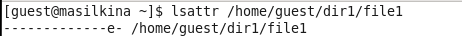
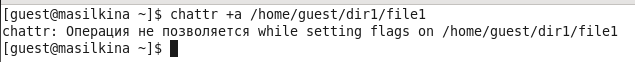
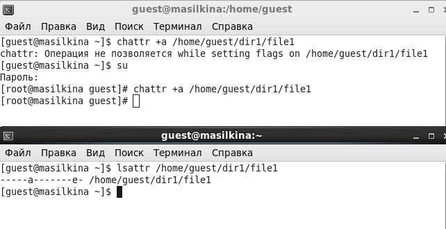
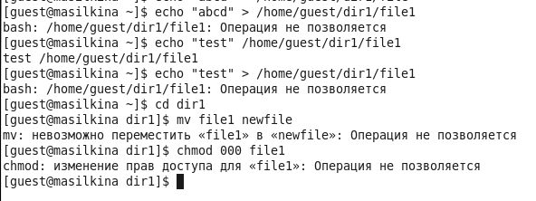
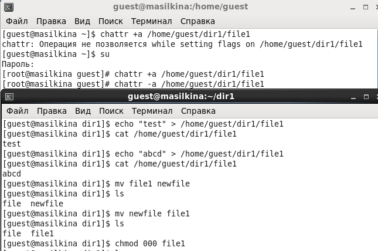
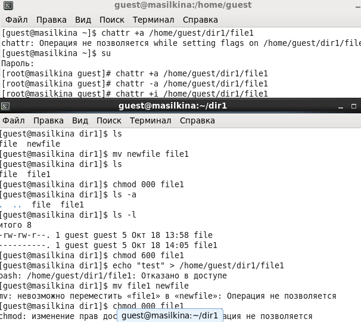

---
# Front matter
title: "Лабораторная работа №4."
subtitle: "Дискреционное разграничение прав в Linux. Расширенные атрибуты"
author: "Силкина Мария Александровна"

# Formatting
toc-title: "Содержание"
toc: true # Table of contents
toc_depth: 2
lof: true # List of figures
lot: true # List of tables
fontsize: 12pt
linestretch: 1.5
papersize: a4paper
documentclass: scrreprt
polyglossia-lang: russian
polyglossia-otherlangs: english
mainfont: PT Serif
romanfont: PT Serif
sansfont: PT Sans
monofont: PT Mono
mainfontoptions: Ligatures=TeX
romanfontoptions: Ligatures=TeX
sansfontoptions: Ligatures=TeX,Scale=MatchLowercase
monofontoptions: Scale=MatchLowercase
indent: true
pdf-engine: lualatex
header-includes:
  - \linepenalty=10 # the penalty added to the badness of each line within a paragraph (no associated penalty node) Increasing the value makes tex try to have fewer lines in the paragraph.
  - \interlinepenalty=0 # value of the penalty (node) added after each line of a paragraph.
  - \hyphenpenalty=50 # the penalty for line breaking at an automatically inserted hyphen
  - \exhyphenpenalty=50 # the penalty for line breaking at an explicit hyphen
  - \binoppenalty=700 # the penalty for breaking a line at a binary operator
  - \relpenalty=500 # the penalty for breaking a line at a relation
  - \clubpenalty=150 # extra penalty for breaking after first line of a paragraph
  - \widowpenalty=150 # extra penalty for breaking before last line of a paragraph
  - \displaywidowpenalty=50 # extra penalty for breaking before last line before a display math
  - \brokenpenalty=100 # extra penalty for page breaking after a hyphenated line
  - \predisplaypenalty=10000 # penalty for breaking before a display
  - \postdisplaypenalty=0 # penalty for breaking after a display
  - \floatingpenalty = 20000 # penalty for splitting an insertion (can only be split footnote in standard LaTeX)
  - \raggedbottom # or \flushbottom
  - \usepackage{float} # keep figures where there are in the text
  - \floatplacement{figure}{H} # keep figures where there are in the text
---

# Цель работы

Получение практических навыков работы в консоли с расширенными атрибутами файлов.

# Задачи

1. Выполнить лабораторную работу согласно заданному порядку.

2. Ознакомится с расширенными атрибутами.

# Выполнение лабораторной работы 

Первый шаг заключался в определении от пользователя guest расширенных атрибутов файла с помощью команды **lsattr /home/guest/dir1/file1**. Я узнала, что файл file1 содержит атрибут "е" (рис 1. -@fig:001).

{ #fig:001 width=70% }

Далее установила командой **chmod 600 file1** права, разрешающие чтение и запись для владельца файла (рис 2. -@fig:002). 

{ #fig:002 width=70% }

Через пользователя guest попробовала установить на файл расширенный атрибут "а", но не вышло (рис 3. -@fig:003).

{ #fig:003 width=70% }

Зашла во вторую консоль с правами администратора и выполнила команду **chattr +a /home/guest/dir1/file1** от имени суперпользователя и проверила от имени суперпользователя выполнение данной команды (рис 4. -@fig:004)

{ #fig:004 width=70% }

Выполнила следующие действия при этом атрибуте: дозапись в файл, стереть информацию, переименовать файл, установить права 000. Успешно не удалось это сделать, так как атрибут "а" ограничивает (рис 5. -@fig:005). 

{ #fig:005 width=70% }

Далее я сняла этот атрибут и попыталась повторить все те же самые действия. При снятии атрибута все действия были успешно выполнены (рис 6. -@fig:006).

{ #fig:006 width=70% }

Последним шагом нужно было попроовать проделать все те же самые действия при помощи атрибута "i", но не удалось, так как атрибут i тоже ограничивает возможность данных действий (рис 7. -@fig:007).

{ #fig:007 width=70% }

# Выводы

При выполнении данной лабораторной работы я получила практические навыки работы в консоли с расширенными атрибутами файлов. Ознакомилась с такими атрибутами как "a" и "i".

# Библиография

1. Кулябов Д. С., Королькова А. В., Геворкян М. Н. Информационная безопасность компьютерных сетей. Лабораторная работа № 4. Дискреционное разграничение прав в Linux. Расширенные атрибуты